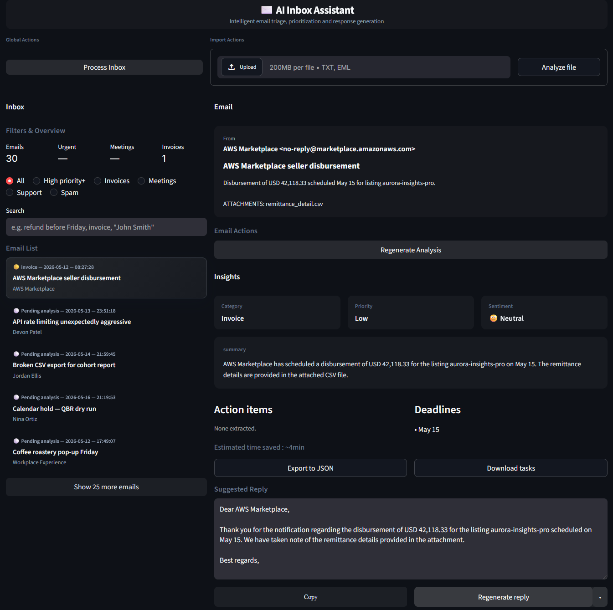

# AI Inbox Assistant

Intelligent email triage, prioritization, and AI-generated replies for enterprise inbox workflows.



AI Inbox Assistant is a SaaS-style internal operations tool that helps teams turn messy inboxes into structured, actionable work. It classifies emails, detects priority, summarizes context, extracts tasks, and drafts replies using an LLM-backed workflow.

## Why This Project?

Managing large inboxes is repetitive, time-consuming, and easy to miss under pressure.

AI Inbox Assistant helps teams:

- detect urgent or high-priority messages,
- summarize long or noisy emails,
- extract action items and deadlines,
- generate contextual reply drafts,
- process an entire inbox in batches,
- export structured analysis for downstream workflows.

The project is designed as a realistic product prototype: polished UI, API-first backend, structured LLM outputs, and practical operations-focused UX.

## Features

- AI-powered email classification
- Priority detection for urgent, high, medium, and low importance
- Automatic summaries for faster triage
- Sentiment and intent extraction
- Action item and deadline extraction
- AI-generated suggested replies
- Regenerate reply with custom reply style
- Batch inbox processing
- Single email analysis
- Upload `.txt` and `.eml` emails
- Search and AI-based category filters
- Export full analysis to JSON
- Export tasks and deadlines separately

## Product Preview

### Inbox Triage

Browse emails, identify pending analysis, run batch processing, and filter the inbox using AI-generated categories.


### AI Analysis

Each analyzed email includes category, priority, sentiment, summary, action items, deadlines, entities, and a contextual suggested reply.

## Tech Stack

- **Frontend:** Streamlit, custom CSS, SaaS-style dark UI
- **Backend:** FastAPI, Pydantic, Uvicorn
- **LLM providers:** Groq by default, OpenAI-compatible fallback
- **Data:** Local demo inbox with `.txt` files and `.eml` upload support
- **Testing:** Pytest and pytest-asyncio

## Architecture

```text
project_root/
├── app/
│   ├── api/              # REST routes: /emails, /analyze, /reply
│   ├── core/             # Settings and environment configuration
│   ├── services/         # Email repository, LLM orchestration, cache
│   ├── models/           # Shared Pydantic schemas
│   ├── prompts/          # Versioned prompts for analysis and replies
│   ├── utils/            # Email parsing, JSON extraction, urgency hints
│   └── main.py           # FastAPI app, CORS, lifespan
├── frontend/
│   └── streamlit_app.py  # Product UI
├── emails/               # Demo inbox data
├── scripts/              # Dataset generation helpers
├── tests/
└── requirements.txt
```

High-level flow:

1. The backend indexes demo emails on startup.
2. The Streamlit UI requests the inbox list and selected email details.
3. `POST /analyze` sends an email through the LLM workflow and validates the structured JSON result.
4. `POST /reply` regenerates only the reply draft with an optional custom tone.
5. The UI stores session-level analysis state, edited replies, and export-ready results.

## Setup

### Prerequisites

- Python 3.12+
- Groq API key from the [Groq Console](https://console.groq.com/keys), or an OpenAI key if using `LLM_PROVIDER=openai`

### Installation

```powershell
cd ai-inbox-assistant
python -m venv .venv
.\.venv\Scripts\Activate.ps1
pip install -r requirements.txt
copy .env.example .env
```

Then set `GROQ_API_KEY` in `.env` for the default Groq setup, or configure OpenAI variables if using OpenAI.

### Environment Variables

See `.env.example`. Main settings:

| Variable | Description |
| --- | --- |
| `LLM_PROVIDER` | `groq` by default, or `openai`. |
| `GROQ_API_KEY` | Groq API key for `/analyze` and `/reply`. |
| `GROQ_MODEL` | Groq model name. |
| `OPENAI_API_KEY` | Required if `LLM_PROVIDER=openai`. |
| `OPENAI_MODEL` | OpenAI model name when used. |
| `EMAILS_DIR` | Demo emails directory. |
| `CORS_ORIGINS` | Allowed frontend origins. |
| `STREAMLIT_API_BASE` | Backend URL used by Streamlit. |

## Run Locally

Start the backend:

```powershell
uvicorn app.main:app --reload --host 0.0.0.0 --port 8000
```

Health check:

```text
http://127.0.0.1:8000/health
```

Interactive API docs:

```text
http://127.0.0.1:8000/docs
```

In a second terminal, start the frontend:

```powershell
streamlit run frontend/streamlit_app.py
```

The app opens at:

```text
http://localhost:8501
```

## Demo Dataset

Demo emails live under `emails/<folder>/email_XX.txt`. The folders are used only to organize sample data; classification in the UI comes from AI analysis, not from folder names.

To regenerate the dataset:

```powershell
python scripts/generate_emails.py
```

Supported upload formats:

- `.txt` using the demo header format
- `.eml` exports from email clients such as Outlook or Thunderbird

Example `.txt` format:

```text
FROM: Name <email>
TO: recipient
SUBJECT: ...
DATE: ...
THREAD-ID: ...
ATTACHMENTS: file1.pdf, file2.png

Message body...
```

## Tests

```powershell
pytest
```

## Future Improvements

- Gmail OAuth integration
- Multi-user accounts and team workspaces
- Database persistence for analyzed emails
- Async background processing for large inboxes
- Shared task queues and collaboration features
- Production deployment with auth, observability, and rate limits
- Calendar/task manager integrations

## Troubleshooting

- Missing `GROQ_API_KEY` or `OPENAI_API_KEY`: `/analyze` and `/reply` return a clear `503`.
- Quota or rate limits: the LLM service retries on `429`.
- Missing `emails` directory: the backend fails fast on startup.
- Invalid LLM output: schema validation returns a clear error so the user can retry.

## License

See `LICENSE`.
